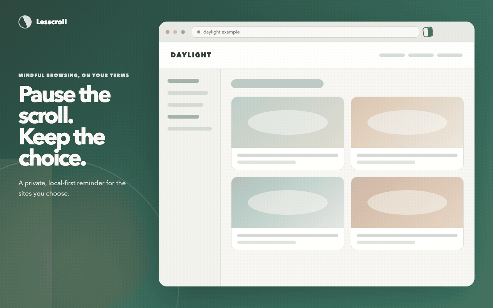

<p align="center">
  
</p>

<h1 align="center">Lesscroll</h1>

<p align="center">
  Pause mindless scrolling. Keep the final choice.
</p>

<p align="center">
  <a href="https://lesscroll.nemvik.com/">Website</a> ·
  <a href="https://chromewebstore.google.com/detail/lesscroll/mmlpldkiccpikaihihbcfkaffigapfjg">Chrome Web Store</a> ·
  <a href="https://lesscroll.nemvik.com/privacy">Privacy</a> ·
  <a href="https://lesscroll.nemvik.com/#support">Support</a> ·
  <a href="SECURITY.md">Security</a> ·
  <a href="https://github.com/nemvik/lesscroll/issues">Issues</a> ·
  <a href="LICENSE">MIT License</a>
</p>



Lesscroll is an open-source Chrome Manifest V3 extension that interrupts
mindless scrolling without blocking websites. It measures focused time only on
sites you choose, then lets you leave, snooze the reminder, or continue
intentionally.

The extension has no backend, account, cloud sync, advertising, analytics,
telemetry, remote script, or external API. It temporarily processes the current
URL to match a rule that you created, but it neither reads nor stores page
content and does not transmit your data. Lesscroll data stays in Chrome's local
extension storage on your device.

## Why Lesscroll

Most focus tools make the decision for you by blocking access. Lesscroll takes a
different approach: it creates a deliberate pause, shows the time you have
spent, and leaves the decision with you.

- Set a continuous-session limit, a daily limit, or both.
- Count time only while the matching tab and Chrome window are active.
- Track only domains you explicitly add.
- Leave the site, snooze the reminder, or continue intentionally.
- Use the interface in English or Czech.
- Reset today's counters or all locally stored data at any time.

## Installation

[Install Lesscroll from the Chrome Web Store](https://chromewebstore.google.com/detail/lesscroll/mmlpldkiccpikaihihbcfkaffigapfjg).

### Build from source

Requirements:

- Node.js 22 or newer
- pnpm 11.7.0 through Corepack
- Google Chrome 120 or newer

```bash
corepack enable
pnpm install
pnpm build
```

Then open `chrome://extensions`, enable **Developer mode**, select
**Load unpacked**, and choose `dist/unpacked-extension`.

## How it works

The background service worker is the single writer for rules and timers.
Chrome tab, window, alarm, and extension-message events pass through one
serialized reconciliation queue. Usage is derived from timestamps rather than
a continuous interval timer.

- Only the active tab in the focused Chrome window can accrue time.
- Leaving a tracked site closes and persists the active segment immediately.
- Returning within the configured reset window resumes the session.
- Current-day totals roll over at local midnight.
- Browser downtime is never counted after a service-worker or browser restart.
- Delayed alarms favor slight under-counting instead of counting suspended time.
- The most specific enabled rule wins when multiple domains match.

## Privacy and permissions

Lesscroll requests four Chrome permissions, each for one documented purpose:

| Permission | Purpose |
| --- | --- |
| `storage` | Store rules, settings, timers, snoozes, and alert state locally. |
| `alarms` | Schedule checkpoints, limit wakeups, snooze expiry, and midnight rollover. |
| `scripting` | Inject the self-contained decision overlay on an approved site. |
| `activeTab` | Read the current page when you open the popup, without requesting `tabs`. |

HTTP and HTTPS access is optional. Lesscroll requests access only for the
normalized domain you add or enable, including subdomains only when you choose
that option. Permissions that are no longer needed are removed.

The injected overlay uses text nodes, pure DOM creation, and Shadow DOM. It does
not use `innerHTML`, `eval`, remote JavaScript, or remote CSS. Stored data and
runtime messages are validated at the service-worker boundary.

See the full [privacy policy](https://lesscroll.nemvik.com/privacy) and
[security policy](SECURITY.md).

## Stored data

Lesscroll writes one local state object containing:

- configured domain rules and limits;
- current-day usage counters;
- the active timing segment;
- continuous-session state;
- snooze timestamps;
- intentional-continuation suppression state.

Removing the extension removes its local extension storage. Lesscroll never
transmits this data to the developer or a third party.

## Development

```bash
pnpm dev        # WXT development mode
pnpm build      # production Chrome MV3 build
pnpm zip        # Chrome Web Store ZIP
pnpm test       # unit and UI tests
pnpm typecheck  # strict TypeScript check
```

Repository layout:

```text
entrypoints/  Chrome extension entrypoints and UI
src/core/     Pure domain, timing, state, and validation logic
src/background/ Chrome API adapters and the background service
src/shared/   Shared API, localization, form, and UI helpers
src/ui/       React UI tests
public/       Extension icons and English/Czech locales
site/         Public website and privacy policy
promo/        Reproducible promotional artwork
webstore/     Chrome Web Store copy and listing assets
```

The public website is an independent project; its commands are documented in
[`site/README.md`](site/README.md).

<details>
<summary>Manual acceptance checklist</summary>

Use a fresh rule for `youtube.com` with a 2-minute continuous limit and a
5-minute session reset:

- [ ] Keep YouTube active in a focused Chrome window for 2 minutes; the
      fullscreen **Still here?** overlay appears within about 30 seconds.
- [ ] Confirm the overlay shows both the current session and today's total.
- [ ] Switch to another tab and confirm tracked time stops increasing.
- [ ] Return before 5 minutes away and confirm the session resumes.
- [ ] Leave for more than 5 minutes and confirm a new session starts.
- [ ] Choose **Snooze** and confirm the reminder returns after the configured duration.
- [ ] Choose **Continue intentionally** and confirm suppression lasts for its documented lifetime.
- [ ] Choose **Leave site** and confirm the bundled focus page opens.
- [ ] Blur the Chrome window and confirm tracking pauses.
- [ ] Restart Chrome during a segment and confirm closed-browser time is not added.
- [ ] Cross local midnight and confirm today's total resets.

</details>

## Contributing

Bug reports and focused pull requests are welcome. Before a larger change,
please open an issue so the intended behavior and privacy impact can be agreed
on first. Never include private page content, credentials, or browsing data in
an issue or screenshot.

For vulnerabilities, do not open a public issue; follow [`SECURITY.md`](SECURITY.md).

## License

Lesscroll is available under the [MIT License](LICENSE).
